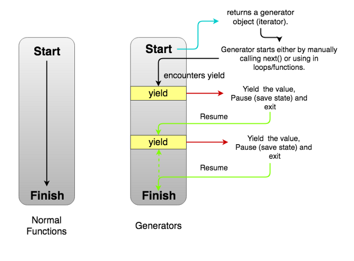

## Agradecimientos

La idea de esta clase está basada en una charla que dio Juan Pedro Fisanotti (Fisa) en PyCon 2018/2019, basada en el lenguaje Python. Pueden ver la explicación en [youtube](https://www.youtube.com/watch?v=BenwwgMx3Hg).

En el presente ejemplo vamos a desarrollar técnicas asincrónicas para comprender cómo se realizan tareas concurrentes en una Virtual Machine basada en Javascript.

## Iteradores

En otras materias hemos conocido el patrón [Iterator](https://en.wikipedia.org/wiki/Iterator_pattern), cuyo fin es desacoplar la forma en la que se almacenan elementos vs. el mecanismo por el cual los recorremos. Podemos así diferenciar las pilas, colas, listas simplemente/doblemente enlazadas, arrays estáticos por un lado, y recorrido secuencial, por un orden alfabético, filtrando ciertos elementos por el otro.

Javascript permite definir iteradores, por ejemplo para definir el movimiento de jugadores de ajedrez:

```js
const crearPartida = () => {
  let blancas = true
  
  return {
    next: () => {
      const result = {
        value: (blancas ? "blancas" : "negras"),
        done: false
      }
      blancas = !blancas
      return result
    }
  }
}
```

La interfaz del iterador de Javascript requiere una función `next()` que devuelve un JSON con dos valores:

- **value**: el valor correspondiente a esta iteración
- **done**: indica si se terminó la iteración

```js
partida = crearPartida()
{next: ƒ}
partida.next()
{"value": "blancas", "done": false}
partida.next()
{"value": "negras", "done": false}
partida.next()
{"value": "blancas", "done": false}
partida.next()
{"value": "negras", done: false}
```

Esto puede resultar un poco diferente a la iteración en Java, donde si intentamos pedir `next()` a un iterador que no tiene elementos, deberíamos esperar un error. Por eso tenemos otro método `hasNext()` que nos indica si hay más elementos:

Te dejamos para que investigues el [ejemplo que genera un rango finito de números](./01-generador/rango.ts) con sus [correspondientes tests](./01-iterador/rango.spec.ts).

## Generadores

Las funciones **generadoras** simplifican la creación de estructuras iterables, sin necesidad de mantener un estado interno como los iteradores. Veamos un ejemplo:

```js
function* frutas() {
  yield 'pera'
  yield 'banana'
  console.log('ya vengo pipon')
  yield 'manzana'
  yield 'damasco'
}
```
- La sintaxis para crear una función generadora es `function*`.
- Cuando invocamos a la función `frutas()` desde la consola, lo que retorna es un _iterable_, un elemento **que se puede recorrer** como hemos visto antes, mediante sucesivas llamadas a `next()`.
- Para entender lo que hace el comando `yield`, veamos cómo se utiliza frutas en la consola


Este código que puede ejecutar en tu navegador, primero llama a frutas y lo asocia a un iterable. Luego vamos llamando a `next()` sucesivamente: la función frutas encuentra `yield 'pera'`, entonces devuelve el JSON

```json
{ "value": "pera", "done": false }
```

y la función `frutas()` **se pausa**. Esto implica que sabemos cuál fue la última línea que se ejecutó, pero el control vuelve a estar del lado de la consola. Con el segundo llamado a `next()`, se produce el segundo yield: `yield "banana"`. Eso devuelve el JSON:

```json
{ "value": "banana", "done": false }
```

y nuevamente se pausa la función frutas. Nuevamente enviamos el mensaje `next()` y lo interesante aquí es que se van a ejecutar dos líneas: el console.log y por último el yield. Porque no es necesario que cada línea de un generador haga siempre `yield`, podemos realizar varias cosas antes de devolver el control a quien nos llamó.



Te dejamos [una segunda variante del Rango definido con un método generador en un objeto](./02-generador/rango.ts), con [sus correspondientes tests](./02-generador/rango.spec.ts).

## Concurrencia vs. paralelismo

Antes de continuar, es importante distinguir la diferencia entre **concurrencia** y **paralelismo**.

- cocinar y pasar el trapo, leer los mails y jugar una carrera con el Super Mario Bros, cantar una canción y contar un chiste, son actividades que pueden darse en forma concurrente: en el lapso de una hora la cocina quedó limpia y tenemos un locro preparado. No obstante, si en distintos instantes observamos qué estamos haciendo, será una cosa u otra, pero _no las dos al mismo tiempo_. Aquí hablamos de **concurrencia**: estamos haciendo varias tareas a la vez aunque vamos alternando entre cada una de ellas.


- por el contrario, podemos estar cruzando la calle, mirando el celular (en forma descuidada) y transpirando, esas tres acciones ocurren al mismo tiempo. Aquí tenemos **paralelismo**.


Para más información recomendamos leer [este artículo](https://blog.usejournal.com/lets-understand-the-difference-between-concurrency-and-parallelism-80be6c61ad24).


## Ejecutando funciones en forma concurrente

### JVM: Múltiples hilos

Si queremos ejecutar dos funciones en forma concurrente, tenemos estas alternativas:

- **trabajar con múltiples hilos**, como hace la JVM (Java Virtual Machine). Entonces cada función corre en un hilo con su propio estado, y todo es bastante simple... salvo que ambas funciones necesiten acceder a un estado compartido. Por ejemplo, dos _threads_ que trabajan con el mismo objeto en memoria, y ejecutan dos métodos diferentes

```xtend
class Cliente {
  int saldo

  def pagar(int cuanto) {
    val nuevoSaldo = saldo - cuanto - this.calcularPunitorio() 
    saldo = nuevoSaldo
  }

  def facturar(int cuanto) {
    saldo = saldo + cuanto
  }
}
```

Se puede dar la siguiente situación:

- el thread 1 ejecuta el método pagar, el saldo actual es 100, está pagando 100 y el cálculo de punitorios le da 0, la variable nuevoSaldo es 0 (100 - 100 - 0). 
- el thread 2 ejecuta el método facturar 500 pesos. El saldo se actualiza a 500.
- el thread 1 ejecuta la segunda línea del método pagar => el saldo = 0, **pisa el valor que el thread 2 había calculado**. Esto es lo que se conoce como _race condition_ o condición de carrera, y por eso en Java podemos generar un _lock_ sobre el objeto, hasta tanto termine la ejecución del método, mediante la directiva `synchronized`:

```xtend
class Cliente {
  int saldo

  def synchronized pagar(int cuanto) {
    val nuevoSaldo = saldo - cuanto - this.calcularPunitorio() 
    saldo = nuevoSaldo
  }

  def synchronized facturar(int cuanto) {
    saldo = saldo + cuanto
  }
}
```

De todas maneras, debemos asegurarnos de no estar tratando de acceder a algún otro recurso compartido que ya esté bloqueado por otro proceso, y aun peor, que ese proceso no esté esperando que nosotros terminemos de soltar nuestro objeto. En ese caso llegaremos a un incómodo _deadlock_, donde dos procesos no sueltan un recurso y quedan inmóviles (en _starvation_):


### VM de JS: Un solo hilo

En el entorno de Typescript estamos corriendo una Virtual Machine de Javascript, que implementa un solo thread. ¿Cómo podemos ejecutar entonces dos funciones en forma concurrente? Ejecutando funciones **asincrónicas**, cuya ejecución iremos pausando hasta tanto se complete todo el requerimiento que dicha función debe cumplir. Ya les hemos presentado las funciones pausables, son los iteradores y generadores con los que iniciamos esta explicación.

Ahora veremos un ejemplo más concreto:

- queremos estudiar este tema
- y hacer algo de ejercicio

Podemos modelarlo con objetos o funciones, vamos a resolverlo ahora con funciones, las diferencias en la implementación son muy sutiles.

Definiremos la función que estudia promises:

```ts
function* estudiarPromises(): Generator<void> {
  console.log('voy a estudiar promises')
  console.log('sí que lo voy a hacer')
  yield
  console.log('leo iteradores')
  console.log('hago un ejercicio de un iterador')
  yield
  console.log('repaso iterador')
  console.log('leo generadores')
  console.log('hago un ejercicio de un generador')
  console.log('repaso generador')
}
```

Y también leemos Twitter:

```ts
function* leerTwitter(): Generator<void> {
  console.log('leemos nuestra página de Twitter')
  yield
  console.log('leemos trending topics')
  console.log('posteamos indignación total!!')
  yield
  console.log('mensaje privado a un amigue')
  yield
  console.log('cargamos foto en la página de Twitter')
  console.log('posteamos un fotoshop gracioso')
}
```

Ahora definiremos una función que va a recibir la lista de tareas y las va a ejecutar parte por parte:

```ts
function ejecutar(tareas: Generator<void>[]) {
  let i = 0
  while (!isEmpty(tareas)) {
    const actual = tareas[i]
    const { done } = actual.next()
    console.log('------------------------------------------')
    if (done) {
      // eliminamos la tarea
      tareas.splice(i, 1)
    }
    i++
    if (i >= tareas.length) {
      i = 0
    }
  }
}
```

En el archivo escribimos la llamada a la función ejecutar:

```ts
ejecutar([estudiarPromises(), leerTwitter()])
```

y desde la terminal podemos ejecutar typescript con ts-node, por ejemplo:

```bash
npx ts-node tareas.ts
```

Aquí vemos cómo las _corrutinas_ estudiarPromises y leerTwitter se van ejecutando por partes, liberando la atención del procesador con la instrucción _yield_:


### Introduciendo un Delay

Supongamos que la foto tarda 10 segundos en subir. Lo podemos reflejar haciendo un pequeño cambio en nuestra función leerTwitter:

```ts
function sleep(milisegundos: number) {
  var now = new Date().getTime()
  while (new Date().getTime() < now + milisegundos) { /* do nothing */ }
}

function* leerTwitter(): Generator<void> {
  console.log('leemos nuestra página de Twitter')
  yield
  sleep(10000)
  console.log('cargamos foto en la página de Twitter')
  console.log('posteamos un fotoshop gracioso')
  yield
  console.log('mensaje privado a un amigue')
  yield
  console.log('leemos trending topics')
  console.log('posteamos indignación total!!')
}
```

Como vemos ahora, ocurre en el segundo paso y los 15 segundos que tarda en subir la foto se notan:


El único thread que tiene la Virtual Machine de JS se está bloqueando y eso impide que cualquier otro proceso pueda tomar el control.


> **Corolario:** en JS debemos ser todavía más cuidadosos de no entrar en loops infinitos porque bloquearemos la virtual machine de nuestro navegador, o de nuestro servidor (si es que el server de Backend corre sobre NodeJS por ejemplo)

### Anidando yields

Existe una variante de `yield` con asterisco, que nos permite devolver una lista de valores, si es que no necesitamos hacer nada entre cada pausa:

```js
function* frutasComoLista() {
  yield* ["pera", "banana", "manzana", "damasco"]
}
```

Y en la consola podemos evaluar:

```js
const listaFrutas = frutasComoLista()
frutasComoLista {<suspended>}

listaFrutas.next()
{value: "pera", done: false}

listaFrutas.next()
{value: "banana", done: false}

/* etc. */
```

Esta variante es útil para delegar la subida de la foto en otra función generadora:

```ts
function* leerTwitter(): Generator<void> {
  console.log('leemos nuestra página de Twitter')
  yield
  yield* subirFoto()
  console.log('posteamos un fotoshop gracioso')
  yield
  console.log('mensaje privado a un amigue')
  yield
  console.log('leemos trending topics')
  console.log('posteamos indignación total!!')
}
```

Claro que para que sea efectivo, estaría bueno particionar la operación "subir foto" en partes más pequeñas:

```ts
function* subirFoto(): Generator<void> {
  for (let i of [1, 2, 3, 4, 5]) {
    console.log('subiendo parte ', i)
    sleep(2000)
    yield
  }
}

function* leerTwitter(): Generator<void> {
  console.log('leemos nuestra página de Twitter')
  yield
  yield* subirFoto()
  console.log('posteamos un fotoshop gracioso')
  yield
  console.log('mensaje privado a un amigue')
  yield
  console.log('leemos trending topics')
  console.log('posteamos indignación total!!')
}
```

Esto permite que mientras está subiendo la foto, podamos terminar de estudiar este artículo:


Podés ver [el desarrollo completo de la solución](./03-tareasFuncionalosas/tareas.ts).

## Comparación un thread vs. multithreading

Como hemos visto, trabajar con un hilo solo expone a que un error involuntario o adrede cause que nuestro proceso de Node quede totalmente bloqueado. Basta con definir un loop infinito en cualquiera de las corrutinas para que podamos experimentarlo en carne propia:


El modelo de _threads_ de Java evita ensuciar nuestro código con instrucciones `yield`: si cada proceso ejecuta en forma independiente esto hace que el algoritmo de ejecución dentro del procesador sea transparente para el desarrollador. 

Los problemas empiezan a ocurrir cuando la concurrencia utiliza recursos compartidos (y los modifica), cuando tenemos actividades de I/O (en una aplicación web esto ocurre permanentemente), y cuando tenemos una alta tasa de usuarios concurrentes, que necesita un gran número de hilos para soportarlo.

Aquí es donde **una arquitectura mono-hilo que garantice que todas sus operaciones son no-bloqueantes puede sacar ventaja**: no tiene costo de _context switch_, entonces todo el tiempo estará ejecutando una tarea sin tener que desdoblarse en hilos. Por supuesto, cada uno es responsable de que sus tareas comiencen y terminen en un tiempo razonable.

## Refactor de nuestra solución

Vamos a refactorizar nuestra solución inicial, en lugar de tener corrutinas con varias instrucciones yield, generaremos nuevas corrutinas que representan las porciones de operación de `estudiarPromises` y `leerTwitter`:

```ts
function* leerPaginaTwitter(): Generator<void> {
  console.log('leemos nuestra página de Twitter')
}

function* postPhotoshopGracioso(): Generator<void> {
  console.log('posteamos un fotoshop gracioso')
}

function* mensajeAmigue() {
  console.log('mensaje privado a un amigue')
}

function* leerTwitter(): Generator<void> {
  yield* leerPaginaTwitter()
  yield* subirFoto()
  yield* postPhotoshopGracioso()
  yield* mensajeAmigue()
  console.log('leemos trending topics')
  console.log('posteamos indignación total!!')
}
```

Ahora `leerTwitter` delega en cuatro corrutinas antes de resolver sus propias tareas. Lo mismo hacemos con `estudiarPromises`. Esto tiene el propósito de dividir cada una de las tareas en funciones pausables que no son bloqueantes... y nos permitirá cambiar al formato `async/await` muy fácilmente.

## Async / await

Podemos hacer un cambio más:

- todas las funciones generadoras (`function *`) las vamos a definir como funciones `async`
- lo que devuelven no son `Generator<T>` sino `Promise<T>`, en nuestro caso, todas son void
- y la instrucción `yield` la reemplazamos por `await`

Entonces vemos cómo se resuelve la función que lee twitter ahora:

```ts
async function leerTwitter(): Promise<void> {
  await leerPaginaTwitter()
  await subirFoto()
  await postPhotoshopGracioso()
  await mensajeAmigue()
  console.log('leemos trending topics')
  console.log('posteamos indignación total!!')
}
```

Y un pequeño cambio en las funciones `sleep` y `subirFoto`:

```ts
function sleep(milliseconds: number) {
  return new Promise(resolve => setTimeout(resolve, milliseconds))
}

async function subirFoto(): Promise<void> {
  for (let i of [1, 2, 3, 4, 5]) {
    console.log('subiendo parte ', i)
    await sleep(2000)
  }
}
```

Ahora sí, podemos ejecutar en paralelo todas las tareas, con un algoritmo mucho más sencillo: `Promise.all`

```ts
async function ejecutar(tareas: Promise<void>[]) {
  await Promise.all(tareas)
}

ejecutar([estudiarPromises(), leerTwitter()])
```

Aquí vemos que las tareas se van ejecutando en el mismo orden que en nuestra solución con yield. Solo que desaparecieron las líneas separadoras...


Podés ver [el desarrollo previo, con funciones generadoras](./04-tareasAsyncAwait/tareasPreviasAlAsyncAwait.ts) y [la solución con async/await](./04-tareasAsyncAwait/tareasRefactorizadas.ts).

## Funciones asincrónicas para obtener información del backend

En resumen:

- definir una función `async` es definir una función que ejecuta asincrónicamente como una corrutina
- cada vez que hacemos `await` estamos pausando la ejecución y liberando el thread para que se active otra corrutina
- solo debemos encargarnos de que todas nuestras operaciones sean no bloqueantes

Lo mismo ocurre cuando en lugar de operaciones `void` estamos esperando un valor concreto. Supongamos que estamos viendo la información de un cliente y queremos mostrar las últimas facturas y cuánto es la deuda que mantiene con nosotros. La información se obtiene por un servicio web (lo que llamamos _backend_), por lo tanto, la llamada **puede tardar**: es un pedido que se hace por el protocolo http, que requiere conexión de servidores por la red y eso tiene una [latencia](https://es.wikipedia.org/wiki/Latencia). Lo ideal es que utilicemos una corrutina, es decir que la llamada se envuelva en una función asincrónica no-bloqueante. Veamos cómo sería la implementación con funciones generadoras:

```ts
/** Podría ser una respuesta del backend, y tardar bastante en responder */
function* facturasDelCliente(): Generator<Factura> {
  console.log('resolvemos facturas del cliente')
  return [
    { numero: '0001-00004578', total: 15600, fecha: new Date(), saldo: 0, },
    { numero: '0001-00009126', total: 2200, fecha: new Date(), saldo: 700, },
    { numero: '0001-00009533', total: 18300, fecha: new Date(), saldo: 18300, },
  ]
}

function* saldoDelCliente() {
  console.log('resolvemos el saldo del cliente')
  // Delegamos a la corrutina que obtiene las facturas del cliente
  // se pausa esta función pero no se bloquea al thread
  const facturas = yield* facturasDelCliente()
  const saldo = sumBy(facturas, 'saldo')
  console.log('saldo', saldo)
  yield saldo
}
```

La misma forma la definimos con funciones `async` y esperando dentro de nuestra corrutina el resultado:

```ts
/** Podría ser una respuesta del backend, y tardar bastante en responder */
async function facturasDelCliente() {
  console.log('resolvemos facturas del cliente')
  return [
    { numero: '0001-00004578', total: 15600, fecha: new Date(), saldo: 0, },
    { numero: '0001-00009126', total: 2200, fecha: new Date(), saldo: 700, },
    { numero: '0001-00009533', total: 18300, fecha: new Date(), saldo: 18300, },
  ]
}

async function saldoDelCliente() {
  console.log('resolvemos el saldo del cliente')
  // Para poder sumar el saldo de las facturas, esperamos a las facturas
  // lo que devuelve la función asincrónica lo recibe facturas
  const facturas = await facturasDelCliente()
  const saldo = sumBy(facturas, 'saldo')
  console.log('saldo', saldo)
  return saldo
}
```

## Material adicional

- **Iteradores y Generadores**
  - [Mozilla Developers: Iteradores y Generadores](https://developer.mozilla.org/es/docs/Web/JavaScript/Guide/Iterators_and_Generators)
  - [Understanding JavaScript Generators with Examples](https://codeburst.io/understanding-generators-in-es6-javascript-with-examples-6728834016d5)
  - [Por qué no podemos usar yield dentro de un arrow function](https://stackoverflow.com/questions/33316765/why-is-es6-yield-a-reserved-word-when-called-in-this-context)
  - [Yield is a reserved word](https://github.com/prettier/prettier/issues/1624)
- **Aplicaciones Node vs. Java**
  - [Performance Comparison: Java vs Node
View Larger Image](https://www.tandemseven.com/blog/performance-java-vs-node/)
  - [Speaking Intelligently about "Java vs Node" Performance](https://rclayton.silvrback.com/speaking-intelligently-about-java-vs-node-performance)
