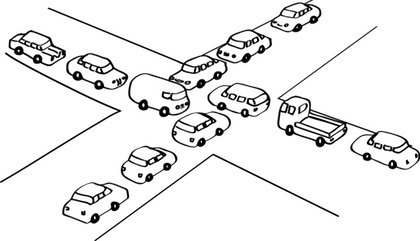

## Agradecimientos

La idea de esta clase está basada en una charla que dio Juan Pedro Fisanotti (Fisa) en PyCon 2018/2019, basada en el lenguaje Python. Pueden ver la explicación en [youtube](https://www.youtube.com/watch?v=BenwwgMx3Hg).

En el presente ejemplo vamos a desarrollar técnicas asincrónicas para comprender cómo se realizan tareas concurrentes en una Virtual Machine basada en Javascript.

## Iteradores

En otras materias hemos conocido el patrón [Iterator](https://en.wikipedia.org/wiki/Iterator_pattern), cuyo fin es desacoplar la forma en la que se almacenan elementos vs. el mecanismo por el cual los recorremos. Podemos así diferenciar las pilas, colas, listas simplemente/doblemente enlazadas, arrays estáticos por un lado, y recorrido secuencial, por un orden alfabético, filtrando ciertos elementos por el otro.

Javascript permite definir iteradores, por ejemplo para definir el movimiento de jugadores de ajedrez:

```js
const crearPartida = () => {
  let blancas = true
  
  return {
    next: () => {
      const result = {
        value: (blancas ? "blancas" : "negras"),
        done: false
      }
      blancas = !blancas
      return result
    }
  }
}
```

La interfaz del iterador de Javascript requiere una función `next()` que devuelve un JSON con dos valores:

- **value**: el valor correspondiente a esta iteración
- **done**: indica si se terminó la iteración

```js
partida = crearPartida()
{next: ƒ}
partida.next()
{value: "blancas", done: false}
partida.next()
{value: "negras", done: false}
partida.next()
{value: "blancas", done: false}
partida.next()
{value: "negras", done: false}
```

Esto puede resultar un poco diferente a la iteración en Java, donde si intentamos pedir `next()` a un iterador que no tiene elementos, deberíamos esperar un error. Por eso tenemos otro método `hasNext()` que nos indica si hay más elementos:

Te dejamos para que investigues el [ejemplo que genera un rango finito de números](./01-generador/rango.ts) con sus [correspondientes tests](./01-iterador/rango.spec.ts).

## Generadores

Las funciones [generadoras](https://developer.mozilla.org/es/docs/Web/JavaScript/Guide/Iterators_and_Generators) simplifican la creación de estructuras iterables, sin necesidad de mantener un estado interno como los iteradores. Veamos un ejemplo:

```js
function* frutas() {
  yield 'pera'
  yield 'banana'
  console.log('ya vengo pipon')
  yield 'manzana'
  yield 'damasco'
}
```
- La sintaxis para crear una función generadora es `function*`.
- Cuando invocamos a la función `frutas()` desde la consola, lo que retorna es un _iterable_, un elemento **que se puede recorrer** como hemos visto antes, mediante sucesivas llamadas a `next()`.
- Para entender lo que hace el comando `yield`, veamos cómo se utiliza frutas en la consola


Este código que puede ejecutar en tu navegador, primero llama a frutas y lo asocia a un iterable. Luego vamos llamando a `next()` sucesivamente: la función frutas encuentra `yield 'pera'`, entonces devuelve el JSON

```json
{ value: "pera", done: false }
```

y la función `frutas()` **se pausa**. Esto implica que sabemos cuál fue la última línea que se ejecutó, pero el control vuelve a estar del lado de la consola. Con el segundo llamado a `next()`, se produce el segundo yield: `yield "banana"`. Eso devuelve el JSON:

```json
{ value: "banana", done: false }
```

y nuevamente se pausa la función frutas. Nuevamente enviamos el mensaje `next()` y lo interesante aquí es que se van a ejecutar dos líneas: el console.log y por último el yield. Porque no es necesario que cada línea de un generador haga siempre `yield`, podemos realizar varias cosas antes de devolver el control a quien nos llamó.


Te dejamos [una segunda variante del Rango definido con un método generador en un objeto](./02-generador/rango.ts), con [sus correspondientes tests](./02-generador/rango.spec.ts).

## Concurrencia vs. paralelismo

Antes de continuar, es importante distinguir la diferencia entre **concurrencia** y **paralelismo**.

- cocinar y pasar el trapo, leer los mails y jugar una carrera con el Super Mario Bros, cantar una canción y contar un chiste, son actividades que pueden darse en forma concurrente: en el lapso de una hora la cocina quedó limpia y tenemos un locro preparado. No obstante, si en distintos instantes observamos qué estamos haciendo, será una cosa u otra, pero _no las dos al mismo tiempo_. Aquí hablamos de **concurrencia**: estamos haciendo varias tareas a la vez aunque vamos alternando entre cada una de ellas.


- por el contrario, podemos estar cruzando la calle, mirando el celular (en forma descuidada) y transpirando, esas tres acciones ocurren al mismo tiempo. Aquí tenemos **paralelismo**.


Para más información recomendamos leer [este artículo](https://blog.usejournal.com/lets-understand-the-difference-between-concurrency-and-parallelism-80be6c61ad24).

_

## Ejecutando funciones en forma concurrente

### JVM: Múltiples hilos

Si queremos ejecutar dos funciones en forma concurrente, tenemos estas alternativas:

- **trabajar con múltiples hilos**, como hace la JVM (Java Virtual Machine). Entonces cada función corre en un hilo con su propio estado, y todo es bastante simple... salvo que ambas funciones necesiten acceder a un estado compartido. Por ejemplo, dos _threads_ que trabajan con el mismo objeto en memoria, y ejecutan dos métodos diferentes

```xtend
class Cliente {
  int saldo

  def pagar(int cuanto) {
    val nuevoSaldo = saldo - cuanto - this.calcularPunitorio() 
    saldo = nuevoSaldo
  }

  def facturar(int cuanto) {
    saldo = saldo + cuanto
  }
}
```

Se puede dar la siguiente situación:

- el thread 1 ejecuta el método pagar, el saldo actual es 100, está pagando 100 y el cálculo de punitorios le da 0, la variable nuevoSaldo es 0 (100 - 100 - 0). 
- el thread 2 ejecuta el método facturar 500 pesos. El saldo se actualiza a 500.
- el thread 1 ejecuta la segunda línea del método pagar => el saldo = 0, **pisa el valor que el thread 2 había calculado**. Esto es lo que se conoce como _race condition_ o condición de carrera, y por eso en Java podemos generar un _lock_ sobre el objeto, hasta tanto termine la ejecución del método, mediante la directiva `synchronized`:

```xtend
class Cliente {
  int saldo

  def synchronized pagar(int cuanto) {
    val nuevoSaldo = saldo - cuanto - this.calcularPunitorio() 
    saldo = nuevoSaldo
  }

  def synchronized facturar(int cuanto) {
    saldo = saldo + cuanto
  }
}
```

De todas maneras, debemos asegurarnos de no estar tratando de acceder a algún otro recurso compartido que ya esté bloqueado por otro proceso, y aun peor, que ese proceso no esté esperando que nosotros terminemos de soltar nuestro objeto. En ese caso llegaremos a un incómodo _deadlock_, donde dos procesos no sueltan un recurso y quedan inmóviles (en _starvation_):



### VM de JS: Un solo hilo

En el entorno de Typescript estamos corriendo una Virtual Machine de Javascript, que implementa un solo thread. ¿Cómo podemos ejecutar entonces dos funciones en forma concurrente? Ejecutando funciones **asincrónicas**, cuya ejecución iremos pausando hasta tanto se complete todo el requerimiento que dicha función debe cumplir. Ya les hemos presentado las funciones pausables, son los iteradores y generadores con los que iniciamos esta explicación.

Ahora veremos un ejemplo más concreto:

- queremos estudiar este tema
- y hacer algo de ejercicio

Podemos modelarlo con objetos o funciones, vamos a resolverlo ahora con funciones, las diferencias en la implementación son muy sutiles.

Definiremos la función que estudia promises:

```ts
function* estudiarPromises(): Generator<void> {
  console.log('voy a estudiar promises')
  console.log('sí que lo voy a hacer')
  yield
  console.log('leo iteradores')
  console.log('hago un ejercicio de un iterador')
  yield
  console.log('repaso iterador')
  console.log('leo generadores')
  console.log('hago un ejercicio de un generador')
  console.log('repaso generador')
}
```

Y también leemos Twitter:

```ts
function* leerTwitter(): Generator<void> {
  console.log('leemos nuestra página de Twitter')
  yield
  console.log('leemos trending topics')
  console.log('posteamos indignación total!!')
  yield
  console.log('mensaje privado a un amigue')
  yield
  console.log('cargamos foto en la página de Twitter')
  console.log('posteamos un fotoshop gracioso')
}
```

Ahora definiremos una función que va a recibir la lista de tareas y las va a ejecutar parte por parte:

```ts
function ejecutar(tareas: Generator<void>[]) {
  let i = 0
  while (!isEmpty(tareas)) {
    const actual = tareas[i]
    const { done } = actual.next()
    console.log('------------------------------------------')
    if (done) {
      // eliminamos la tarea
      tareas.splice(i, 1)
    }
    i++
    if (i >= tareas.length) {
      i = 0
    }
  }
}
```

En el archivo escribimos la llamada a la función ejecutar:

```ts
ejecutar([estudiarPromises(), leerTwitter()])
```

y desde la terminal podemos ejecutar typescript con ts-node, por ejemplo:

```bash
npx ts-node tareas.ts
```

Aquí vemos cómo las _corrutinas_ estudiarPromises y leerTwitter se van ejecutando por partes, liberando la atención del procesador con la instrucción _yield_:


### Introduciendo un Delay

Supongamos que la foto tarda 10 segundos en subir. Lo podemos reflejar haciendo un pequeño cambio en nuestra función leerTwitter:

```ts
function sleep(milisegundos: number) {
  var now = new Date().getTime()
  while (new Date().getTime() < now + milisegundos) { /* do nothing */ }
}

function* leerTwitter(): Generator<void> {
  console.log('leemos nuestra página de Twitter')
  yield
  sleep(10000)
  console.log('cargamos foto en la página de Twitter')
  console.log('posteamos un fotoshop gracioso')
  yield
  console.log('mensaje privado a un amigue')
  yield
  console.log('leemos trending topics')
  console.log('posteamos indignación total!!')
}
```

Como vemos ahora, ocurre en el segundo paso...

- poner un sleep de 20 segundos. Mientras ejecutan esa acción nadie puede hacer nada porque...
- no hay otro thread!
- yield from de Python es el yield *

function* f() {
  yield 5
  yield 7
}

function* g() {
  yield* f()
  yield 6
}


### Otro tipo de generadores

Existe una variante de `yield` con asterisco, que nos permite devolver una lista de valores, si es que no necesitamos hacer nada entre cada pausa:

```js
function* frutasComoLista() {
  yield* ["pera", "banana", "manzana", "damasco"]
}
```

Y en la consola podemos evaluar:

```js
const listaFrutas = frutasComoLista()
frutasComoLista {<suspended>}

listaFrutas.next()
{value: "pera", done: false}

listaFrutas.next()
{value: "banana", done: false}

/* etc. */
```


